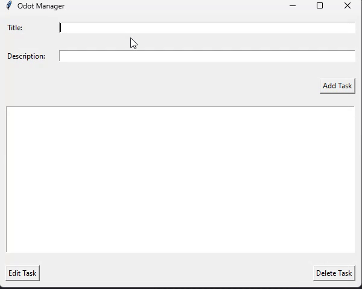

# Odot Manager




A simple task management application built with Python and Tkinter. This application allows users to add, edit, delete, and mark tasks as completed. Tasks are stored in a JSON file to maintain persistence across sessions.

## Features

- **Add Tasks:** Add new tasks with a title and description.
- **Edit Tasks:** Modify the title and description of existing tasks.
- **Delete Tasks:** Remove tasks from the list.
- **Mark as Completed:** Double-click on a task to mark it as completed.
- **Persistence:** Tasks are saved in a JSON file, allowing data to be stored between sessions.

## Installation

### Prerequisites

- Python 3.x installed on your machine.

### Clone the Repository

```bash
git clone https://github.com/Igorth/odot-manager
cd odot-manager
```
## Install Required Packages
No additional packages are required as this project uses the standard library only.

## Usage
### Running the Application
To start the Task Manager application, run the following command:
```commandline
python app.py
```
### Running the Tests
To run the unit tests for the project, use the following command:
```commandline
python -m unittest discover -s tests
```
## Project Structure
```commandline
.
├── README.md
├── app.py
├── task.py
├── task_manager.py
├── tests
│   ├── test_task.py
│   └── test_task_manager.py
└── tasks.json
```
- **app.py**: Main application script using Tkinter for the user interface.
- **task.py**: Defines the Task class.
- **task_manager.py**: Manages the collection of tasks with the TaskManager class.
- **tests**: Contains unit tests for the application.
- **tasks.json**: JSON file used to store tasks.
